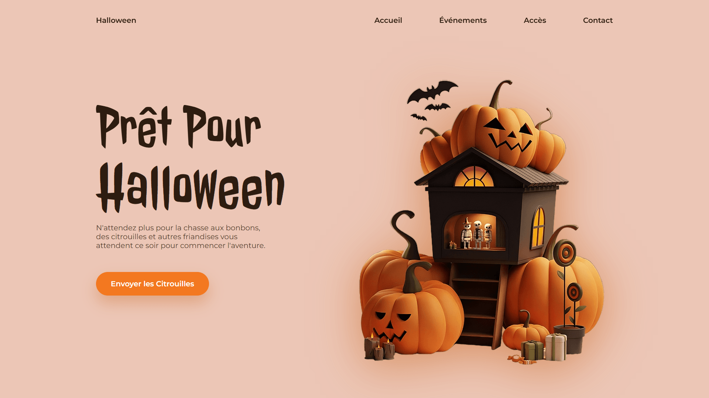

<div align="center">  
  <a href="https://background-animation-halloween2.netlify.app/" target="_blank">  
      
  </a>  
  </br></br>  
  <h3 align="center">🕸️ Page Halloween 2 – Parallax & Citrouilles</h3>  
</div>

## <br /> 📌 Sommaire

&nbsp;&nbsp;&nbsp; 🎨 &nbsp; [**Introduction**](#introduction)<br />
&nbsp;&nbsp;&nbsp; 🛠️ &nbsp; [**Technologies**](#technologies)<br />
&nbsp;&nbsp;&nbsp; 🎯 &nbsp; [**Fonctionnalités**](#fonctionnalités)<br />
&nbsp;&nbsp;&nbsp; 🚀 &nbsp; [**Installation**](#installation)<br />

## <br /> <a name="introduction">🎨 Introduction</a>

Page d’accueil interactive sur le thème d’Halloween, utilisant la bibliothèque **Atropos.js** pour un effet parallax 3D.  
Le design combine animations effrayantes, citrouilles, et un bouton d’appel à l’action immersif.

Idéale pour événements d’Halloween, pages de promotions ou animations web thématiques.

## <br /> <a name="technologies">🛠️ Technologies</a>

- HTML5 sémantique
- CSS3 moderne avec animations, transitions et media queries
- JavaScript ES6
- [GSAP](https://greensock.com/gsap/) (indirectement via animations)
- [Atropos.js](https://atroposjs.com/) pour effet de profondeur
- Remix Icons

## <br /> <a name="fonctionnalités">🎯 Fonctionnalités</a>

- Effet parallax interactif avec Atropos.js
- Deux images superposées avec effet de clignotement
- Titres animés en typo Halloween
- Bouton d’action stylisé “Envoyer les Citrouilles”
- Design responsive adapté à tous les écrans
- Navigation mobile toggle
- Apparition fluide et séquencée des éléments
- Couleurs et typographies sur mesure

## <br /> <a name="installation">🚀 Installation</a>

### ✅ Prérequis

- [Google Chrome](https://www.google.com/) — Navigateur moderne
- [Visual Studio Code](https://code.visualstudio.com/) — Éditeur de code
- [Live Server](https://marketplace.visualstudio.com/items?itemName=ritwickdey.LiveServer) — Extension VS Code

### 📥 Cloner le projet

```bash
git clone https://github.com/ValentinMadiot/background-animation-halloween2_js
cd background-animation-halloween2_js
```

### ▶️ Lancer le projet

Il suffit d’ouvrir le fichier `index.html` dans ton navigateur, ou d’utiliser l’extension **Live Server** sur VS Code pour un aperçu en temps réel.
